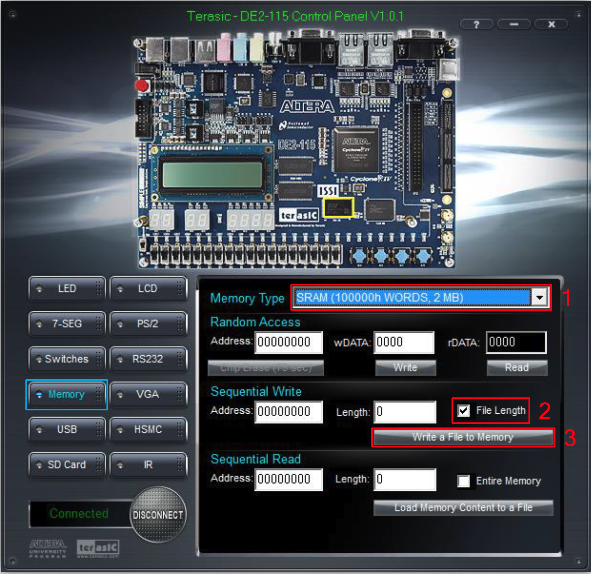

# Final P2P賽車遊戲

### File Structures

```
.
├── README.md
├── doc
│   ├── adxl345.pdf
│   ├── architechure.drawio
│   ├── architechure.png
│   ├── controlPanel.png
│   ├── dell 23 monitor spec.png
│   ├── map.png
│   ├── team04_final_presentation.pdf
│   ├── team04_final_presentation.pptx
│   ├── team04_final_report.docx
│   └── team04_final_report.pdf
├── img
│   ├── bar
│   │   ├── bar.png
│   │   └── bar_digit.png
│   ├── car
│   │   ├── bluecar.png
│   │   ├── graycar.png
│   │   ├── greencar.png
│   │   ├── originalcar1.png
│   │   ├── originalcar2.png
│   │   ├── redcar.png
│   │   ├── whitecar.png
│   │   ├── yellowcar.png
│   │   └── yellowcar2.png
│   ├── idle
│   │   ├── idle_bg.png
│   │   ├── lose.png
│   │   ├── start.png
│   │   └── win.png
│   ├── map
│   │   ├── track_10.png
│   │   └── track_3.png
│   └── qblock
│       └── qblock.png
├── laserCutting
│   ├── paddle
│   │   ├── P5_bottom_1p.bak
│   │   ├── P5_bottom_1p.dxf
│   │   ├── P5_middle_bar_1p.bak
│   │   ├── P5_middle_bar_1p.dxf
│   │   ├── P5_paddle_2P.bak
│   │   ├── P5_paddle_2P.dxf
│   │   ├── P5_side_2P.bak
│   │   ├── P5_side_2P.dxf
│   │   ├── P5_up_bar_1p.bak
│   │   ├── P5_up_bar_1p.dxf
│   │   ├── P5_vertical_1P.bak
│   │   └── P5_vertical_1P.dxf
│   └── wheel
│       ├── W3_fixed_arc_2p.bak
│       ├── W3_fixed_arc_2p.dxf
│       ├── W3_instu_arc_2p.bak
│       ├── W3_instu_arc_2p.dxf
│       ├── W3_side_2p.bak
│       ├── W3_side_2p.dxf
│       ├── W5_bottom_plate_1p.bak
│       ├── W5_bottom_plate_1p.dxf
│       ├── W5_vertical_plate_2P.bak
│       ├── W5_vertical_plate_2P.dxf
│       ├── W5_wheel_1p.bak
│       └── W5_wheel_1p.dxf
├── python
│   ├── atan_lut_verilog_generator.py
│   ├── bin_combinor.py
│   ├── car_verilog_generator.py
│   ├── map.py
│   ├── non_transparent_img_decode.py
│   └── non_transparent_img_verilog_generator.py
├── sim
│   ├── sram
│   │   ├── barDigitLUT.bin
│   │   ├── barLUT.bin
│   │   ├── combinedLUT.bin
│   │   ├── idleBackgroundLUT.bin
│   │   ├── loseLUT.bin
│   │   ├── mapLUT.bin
│   │   ├── qblockLUT.bin
│   │   ├── sram.sv
│   │   ├── startLUT.bin
│   │   └── winLUT.bin
│   ├── tb
│   │   ├── carCollision
│   │   │   ├── run.sh
│   │   │   └── tb.sv
│   │   ├── frameEncoder
│   │   │   ├── runLocal.sh
│   │   │   ├── runRemote.sh
│   │   │   ├── tbLocal.sv
│   │   │   └── tbRemote.sv
│   │   ├── gameControl
│   │   │   ├── runRemote.sh
│   │   │   └── tbRemote.sv
│   │   ├── main
│   │   │   ├── runRemote.sh
│   │   │   └── tbRemote.sv
│   │   └── sram
│   │       ├── runRemote.sh
│   │       └── tbRemote.sv
│   └── tool.sh
└── src
    ├── accHandler
    │   ├── ADXL345_SPI.sv
    │   └── accHandler.sv
    ├── DE2_115
    │   ├── DE2_115.qsf
    │   ├── DE2_115.sdc
    │   ├── DE2_115.sv
    │   ├── Debounce.sv
    │   └── SevenHexDecoder.sv
    ├── frameDecoder
    │   ├── colorDecoder.sv
    │   ├── frameDecoder.sv
    │   ├── palette
    │   │   ├── barDigitPalette.sv
    │   │   ├── barPalette.sv
    │   │   ├── car1Palette.sv
    │   │   ├── car2Palette.sv
    │   │   ├── carCirclePalette.sv
    │   │   ├── idleBackgroundPalette.sv
    │   │   ├── losePalette.sv
    │   │   ├── mapPalette.sv
    │   │   ├── qblockPalette.sv
    │   │   ├── startPalette.sv
    │   │   └── winPalette.sv
    │   ├── pixelDecoder.sv
    │   ├── sramAddrEncoder.sv
    │   └── sramDataDecoder.sv
    ├── frameEncoder
    │   ├── frameEncoder.sv
    │   ├── lut
    │   │   ├── car1LUT.sv
    │   │   └── car2LUT.sv
    │   ├── rotate
    │   │   ├── imageRotator.sv
    │   │   └── rotateImageCoor.sv
    │   └── sramEncoder.sv
    ├── gameControl
    │   ├── basicTrackCollision.sv
    │   ├── carCollision.sv
    │   ├── gameControl.sv
    │   ├── qBlock.sv
    │   └── trackCollision.sv
    ├── main.sv
    ├── math
    │   ├── atanLUT.sv
    │   ├── random.sv
    │   ├── rotateXY.sv
    │   └── sqrt.sv
    ├── pkg
    │   ├── gamePkg.sv
    │   ├── sramPkg.sv
    │   └── trackPkg.sv
    ├── qsys
    │   ├── qsys.bsf
    │   ├── qsys.cmp
    │   ├── qsys.html
    │   ├── qsys.xml
    │   ├── qsys_bb.v
    │   ├── qsys_generation.rpt
    │   ├── qsys_generation_previous.rpt
    │   ├── qsys_inst.v
    │   ├── qsys_inst.vhd
    │   └── synthesis
    │       ├── qsys.debuginfo.xml
    │       ├── qsys.qip
    │       ├── qsys.v
    │       └── submodules
    │           ├── altera_reset_controller.sdc
    │           ├── altera_reset_controller.v
    │           ├── altera_reset_synchronizer.v
    │           ├── qsys_altpll_0.v
    │           └── qsys_usb_0.v
    └── vga.sv
```

### How To Run on DE2-115 with QuartusII

 - [Report](./doc/team04_final_report.pdf)
 - [Presentation Slide](./doc/team04_final_presentation.pdf)
 - [Intro Doc](./README.md)
 - [Demo Video](https://youtu.be/5cRheklZcRc)

1. Open DE2-115 Control Panel (download it on the web) and write in `bin/combinedLUT.bin`
   
2. Set the GPIO pins in `src/DE2_115/DE2_115.sv` (cmd+f/ctrl+f to search all GPIO pins)
3. Compile the project and load the `.sof`

### How To Build Wheels and Paddles

* Both of the design files are designed in Fusion360. Implement with laser-cutting machine

### Before Simulation

```shell
cd Final/sim/
source tool.sh
```

### How To Run Simulation

1. run the following commands in the terminal

    ```shell
    cd Final/sim/sh/[MODULE_NAME]
    source run.sh
    nWave &
    ```

2. open nWave and open the file `sim/sh/tb_MODULE_NAME.fsdb`
3. select desired signals

### How To Check Registers' Type

```shell
cd Final/src/
dv -no_gui
read_sverilog Top.sv # or other file to be checked
```