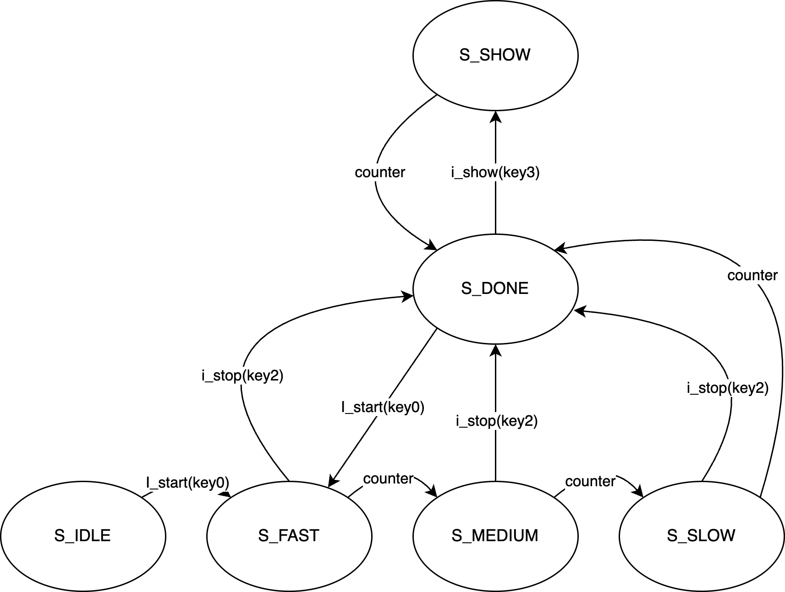

# Lab 1 亂數產生器

### Before Running

```shell
cd Lab1/sim/
source tool.sh
```

### How To Run Simulation

1. open `src/Top.sv` and modify the following periods for shorter simulations
    ```verilog
    // src/Top.sv
    parameter S_PROCESS_PERIOD = 26'b10_0000_0000_0000_0000_0000_0000;
    parameter S_SHOW_PERIOD   = 26'b01_0000_0000_0000_0000_0000_0000;
    ```

2. run the following commands in the terminal
    ```shell
    cd Lab1/sim/
    source run.sh
    nWave &
    ```

3. open nWave and open the file `sim/Lab1_test.fsdb`
4. select desired signals

### How To Check Registers' Type

```shell
cd Lab1/src/
dv -no_gui
read_sverilog Top.sv
```

### Signal, Button Explanation

| Button  | Signal  | Explanation |
|---------|---------|-------------|
| none    | i_clk   | clock       |
| key1    | i_rst_n | reset       |
| key0    | i_start | start the machine |
| key2    | i_stop  | freeze the result |
| key3    | i_show  | show the last result |
| none    | o_random_out | output |

### State Transistion Explanation



1. Initial state is `S_IDLE`. Pressing `key0` will start the machine and go to state `S_FAST`
2. There are three processing state, which are `S_FAST`, `S_MEDIUM` ,and `S_SLOW`. Pressing `key2` will interrupt all three states and got to state `S_DONE`, meaning that we have stop the machine and freezed the result.
3. After the result is out, the machine is now at `S_DONE`. Pressing `key3` will go to `S_SHOW` and display the previous result. Pressing `key0` will go to `S_FAST` and start the next operaion.
4. If we do nothing when the machine is running, it will change state after several cycles. The four transitions are
   1. `S_FAST` -> `S_MEDIUM`, need $2^{25}$ cycles
   2. `S_MEDIUM` -> `S_SLOW`, need $2^{25}$ cycles
   3. `S_SLOW` -> `S_DONE`, need $2^{25}$ cycles
   4. `S_SHOW` -> `S_DONE`, need $2^{24}$ cycles
5. Pressing `key1` will reset the machine.

### Pseudo Random Number Generation Explanaion

We implement the machine by 16-bit XOR LFSR.

 - Feedback polynomial is $x^{16}+x^{15}+x^{13}+x^{14}+1$
 - SEED is set to $2^{15}$ when pressing `key1`, and it will increase $1$ every cycle. When it equals to $0$ it will reset to $2^{15}$
 - Output the last four bit as the result

[Reference](https://en.wikipedia.org/wiki/Linear-feedback_shift_register)

### Display Changing Rate Explanation

| State  | Change Period |
|--------|--------------|
| `S_FAST` | $2^{19}$ clock cycles |
| `S_MEDIUM` | $2^{21}$ clock cycles |
| `S_SLOW` | $2^{23}$ clock cycles |

Modify the period at

```verilog
// output transition
logic [COUNTER_BITS-1:0] temp;
always_comb begin
	o_random_out_w = o_random_out_r;
	temp = counter_r + COUNTER_INC;
	case(state_r)
	S_IDLE: o_random_out_w = o_random_out_r +1;
	S_FAST: 	if (temp[19]^counter_r[19])  o_random_out_w = lfsr_r[3:0];
	S_MEDIUM: 	if (temp[21]^counter_r[21])  o_random_out_w = lfsr_r[3:0];
	S_SLOW: 	if (temp[23]^counter_r[23])  o_random_out_w = lfsr_r[3:0];
	S_DONE: o_random_out_w = i_show ? lastResult_r : o_random_out_r;
	S_SHOW: o_random_out_w = (counter_r == S_SHOW_PERIOD) ? lastResult_r : o_random_out_r;
	endcase
end
```